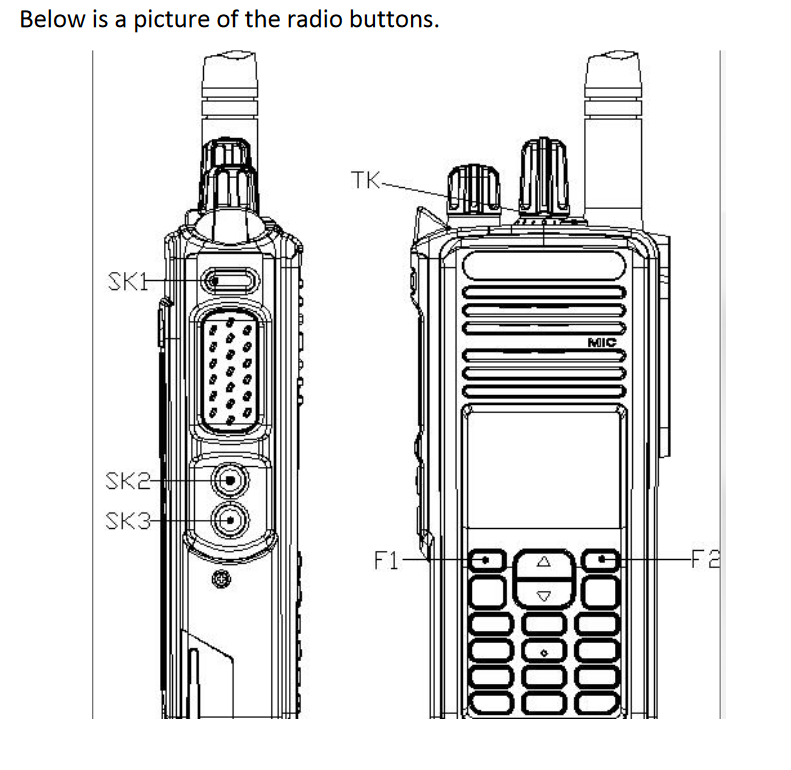
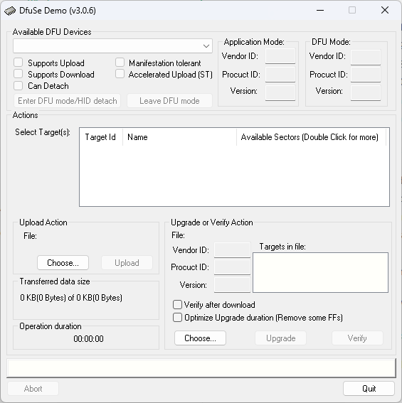
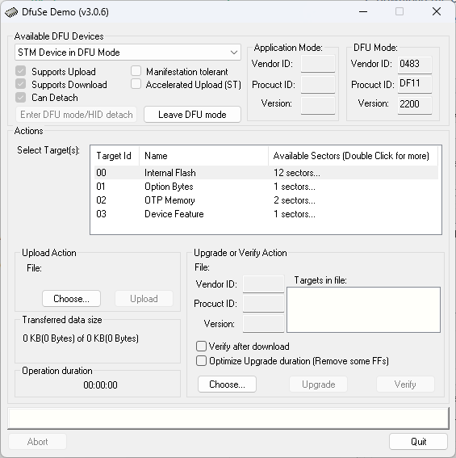
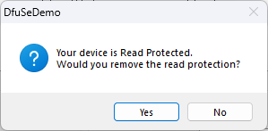
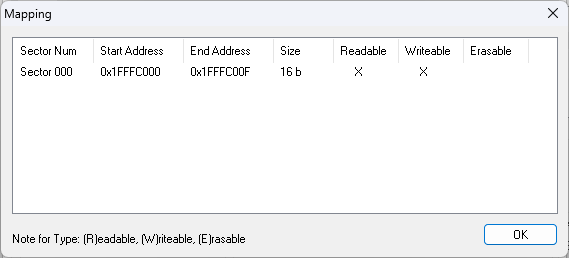
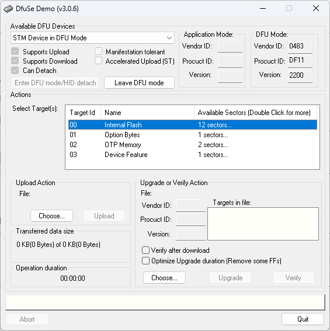
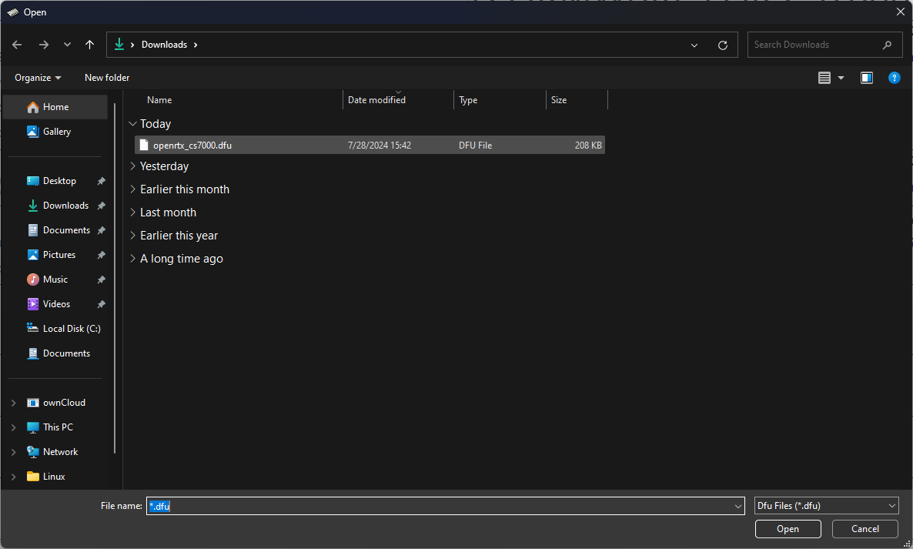
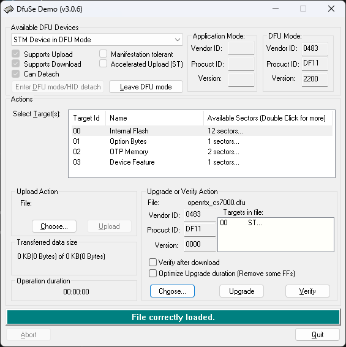
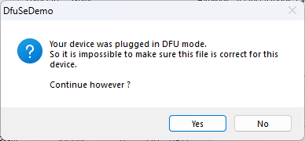
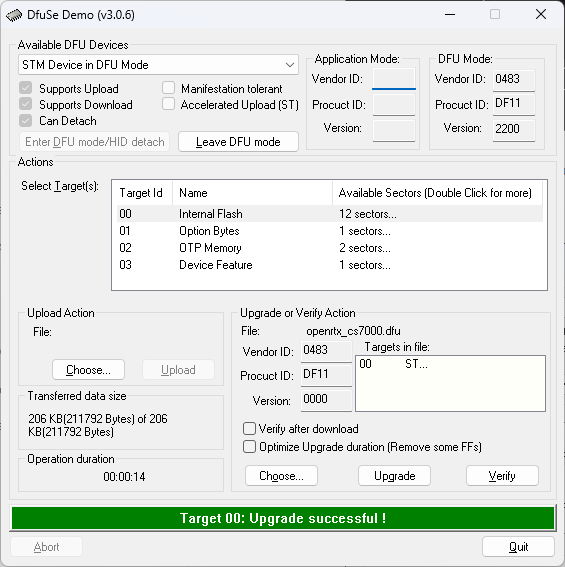

# Flashing OpenRTX to the CS7000-M17

Flashing the CS7000-M17 is a fairly easy process. Be patient and take your time
through the whole process. Read all instructions before attempting to flash
your radio. This document is provided as a guide and is not a replacement for
support by the manufacturer, Connect Systems Inc.

Through the process, references to hardware buttons will be made. For clarity,
the hardware buttons referenced in this document are pictured below.



* SK1 - Side Key 1 - Top button on the left side of the radio. Above the large PTT button.
* SK2 - Side Key 2 - Third button from the top on the left side of the radio. Below the large PTT button.
* SK3 - Side Key 3 - Fourth button from the top on the left side of the radio. Below SK3, second below the large PTT button.
* TK - Top Key - Orange button on the top of the radio. Between the channel select knob and antenna port.
* F1 - Front 1 - Labeled F1 on the front of the radio. Top left hand button.
* F2 - Front 2 - Labeled F2 on the front of the radio. Top right hand button.

You will also need the following:

* CS7000-M17 radio and fully charged battery (obviously.)
* CS7000-M17 Programming Cable
* Flashing software appropriate for your operating system (described in their sections)
* OpenRTX firmware from CSI
* Patience
* Drink of your choice

CSI provides a software page with the OpenRTX firmware, `Openrtx_CS7000.dfu`.
Flashing software for Windows, `DfuSeDemo V3.0.6` is also provided there.

[Connect Systems Software Page for CS7000-M17](https://www.connectsystems.com/products/top/radios/CS7000_M17_SOFTWARE.htm)

Instructions for flashing your radio with [Windows](#windows), [Mac](#mac), and [Linux](#linux) are below.

## Windows

### Flashing software:

DfuSeDemo (version 3.0.6), available from Connect Systems' Software page

### Steps

1. Download and install DfuSeDemo.
2. Download the OpenRTX firmware from CSI's Software page.
3. Open the DfuSeDemo application.

You should see this window on your screen:



4. Attach the Programming Cable to the radio by placing its hook into the
hole next to the antenna port, and pressing the connector against the right
side of the radio. Use the thumbscrew to secure the connector in place.

5. Plug the USB connector from the programming cable into the computer.

6. While pressing and holding SK1, turn the volume control knob clockwise to
power the radio on. The screen will illuminate, and remain blank. The radio is
now in DFU (flashing) mode.

7. Check the DfuSeDemo application to ensure that the radio is recognized.

You should see this window on your screen:



| :exclamation: If you do not see "STM Device in DFU Mode" under Available DFU Devices - `STOP` and wait for Windows to automatically install the driver. |
|------------------------------------------------------------------------------------------------------------------------------------------------------------------|

| :exclamation: If Windows does not automatically install a driver, check Device Manager to see if "STM BOOTLOADER" is present. If you see "STM BOOTLOADER" in Device Manager, and no devices are listed in DfuSeDemo - `STOP` and follow the troubleshooting steps at the bottom of this page. |
|----------------------------------------------------------------------------------------------------------------------------------------------------------------------------------------------------------------------------------------------------------------------------------------------------------|

8. In DfuSeDemo, in the Actions section, double-click the `Target Id 01` (Option Bytes) line item.

You should see this dialog box open:



9. Click on `Yes` to remove read protection.
  * This is a required step before you can flash the OpenRTX firmware to the radio

  | :exclamation: Disabling the read protection on the radio may take a minute or so. `BE PATIENT` |
  |------------------------------------------------------------------------------------------------|

When the process is complete, you should see this dialog box open:



10. Click on `OK`.

11. Turn the volume knob fully counter-clockwise to power the radio off.

12. While pressing and holding SK1, turn the volume control knob clockwise to
power the radio on. The screen will illuminate, and remain blank. The radio is
now in DFU (flashing) mode.

13. Back in the main DfuSeDemo window, select (single-click) the `Target Id 00` (Internal Flash) line item.

The window should look like this:



14. In the Upgrade or Verify Action section, click the `Choose...` button.

15. Use the dialog box to find and select the `openrtx_cs7000.dfu` file downloaded previously.

You might find it in your Downloads folder like below:



16. DfuSeDemo should show a green bar at the bottom, indicating the firmware file loaded correctly.

Like this:



17. Click on the `Upgrade` button.

18. You will receive another dialog box warning you that the radio is in DFU
mode and DfuSeDemo cannot determine if the file is correct for the device. This
is normal, click on `Yes` to proceed.

Click on `Yes`



19. The flashing process will proceed, with a progress bar at the bottom of the
window. When the process is complete, the progress bar will show `Target 00:
Upgrade successful !`

Like this:



20. Turn the volume knob fully counter-clockwise to power the radio off.

21. Remove the programming cable from the radio by loosening the thumbscrew
and lifting the connector away and up from the body of the radio.

22. Turn the volume control knob clockwise to power the radio on. The screen
will illuminate, and show the OPNRTX logo on screen briefly. Once the radio
has booted, you will be presented with the OpenRTX idle screen, showing the
mode (FM), frequency, and battery status. Further information about this
screen will be discussed in the [Operating OpenRTX](/m17/operating.md) section.

#### Congratulations!

You now have flashed the OpenRTX firmware on your radio! Continue on to the
[Operating OpenRTX](/m17/operating.md) section of this Wiki to learn how to use
the OpenRTX firmware, and how to start using the M17 digital radio mode!

## Mac

:exclamation: TBD

## Linux

### Flashing from DMR to Open RTX

There are are several Linux tools available for flashing the STM32 device. This section documents one command line tool, *dfu-util*, and you won't need to install any drivers. It's simple to install on Debian-based systems: `sudo apt install dfu-util`. Just like the Windows example, there are two fundamental steps to flashing your radio from the DMR firmware to the Open RTX firmware:

1. Remove the read protection from the DMR firmware.
2. Install the Open RTX firmware.

First, download the latest OpenRTX firmware from the CSI website and open a shell and cd to where the firmware is.

Do a `dfu-util --help` for a look at possible actions.

Turn your radio off and install the USB cable and plug it into your computer. Start the boot loader: Hold down SK1 and turn the radio on. The screen should be blank.

To make sure your ready to begin, type `dfu-util --list` and you should see some copyright notices and then something like:

```
Found DFU: [0483:df11] ver=2200, devnum=12, cfg=1, intf=0, path="1-1", alt=3, name="@Device Feature/0xFFFF0000/01*004 e", serial="006B518F5253"
Found DFU: [0483:df11] ver=2200, devnum=12, cfg=1, intf=0, path="1-1", alt=2, name="@OTP Memory /0x1FFF7800/01*512 e,01*016 e", serial="006B518F5253"
Found DFU: [0483:df11] ver=2200, devnum=12, cfg=1, intf=0, path="1-1", alt=1, name="@Option Bytes  /0x1FFFC000/01*016 e", serial="006B518F5253"
Found DFU: [0483:df11] ver=2200, devnum=12, cfg=1, intf=0, path="1-1", alt=0, name="@Internal Flash /0x08000000/04*016Kg,01*064Kg,07*128Kg", serial="006B518F5253"
```

You're now ready to remove the read protection from the DMR firmware:

```
dfu-util -s 0x1FFFC000:16:unprotect:force
```

There may be some minor complaints as the utility establishes the connection. Notice here that we are using address and length info from the **Option Bytes** line from the listing above as parameters for this command.

We are now ready to flash OpenRTX:

```
dfu-util -a 0 -D openrtx_cs7000.dfu
```

Again there might be some minor complaints as the utility connects to the radio, but the flashing should take less than a minute. Here, the `-a 0` is used to specify the **Internal Flash** section by using its **alt** value.  After some initial copyright notices, you should see something like ths:

```
Match vendor ID from file: 0483
Match product ID from file: df11
Multiple alternate interfaces for DfuSe file
Opening DFU capable USB device...
Device ID 0483:df11
Device DFU version 011a
Claiming USB DFU Interface...
Setting Alternate Interface #0 ...
Determining device status...
DFU state(10) = dfuERROR, status(10) = Device's firmware is corrupt. It cannot return to run-time (non-DFU) operations
Clearing status
Determining device status...
DFU state(2) = dfuIDLE, status(0) = No error condition is present
DFU mode device DFU version 011a
Device returned transfer size 2048
DfuSe interface name: "Internal Flash  "
File contains 1 DFU images
Parsing DFU image 1
Target name: ST...
Image for alternate setting 0, (1 elements, total size = 211800)
Setting Alternate Interface #0 ...
Parsing element 1, address = 0x08000000, size = 211792
Erase   	[=========================] 100%       211792 bytes
Erase    done.
Download	[=========================] 100%       211792 bytes
Download done.
```

Turn off the radio and unplug the USB cable. You are done!

### Reinstalling, upgrading or downgrading Open RTX

Open a shell tool and cd to where your desired *.dfu firmware file is located. Plug in your radio and start the boot loader. Then:

```
dfu-util -a 0 -D <new dfu filename>
```

Turn off the radio and unplug USB cable, you're done!

### Flashing from Open RTX to DMR

:exclamation: TBD
