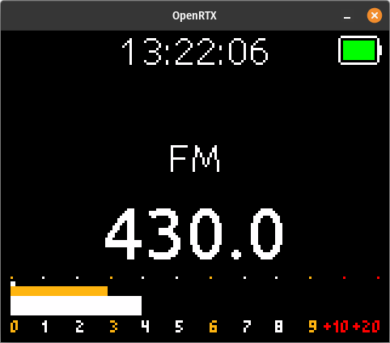
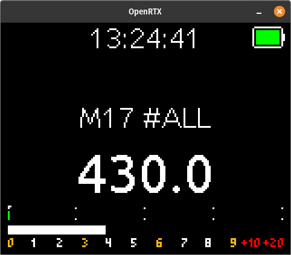
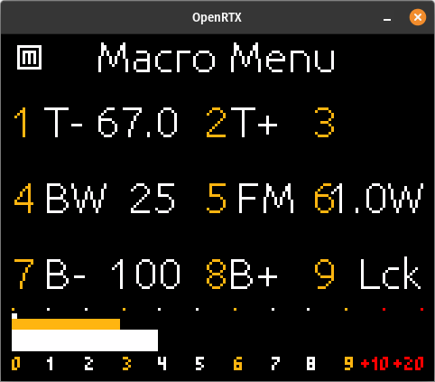
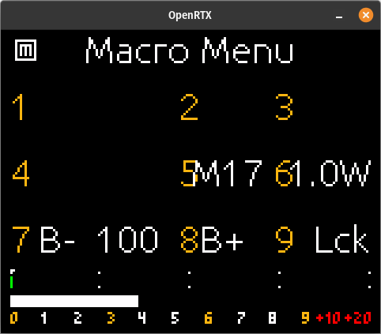
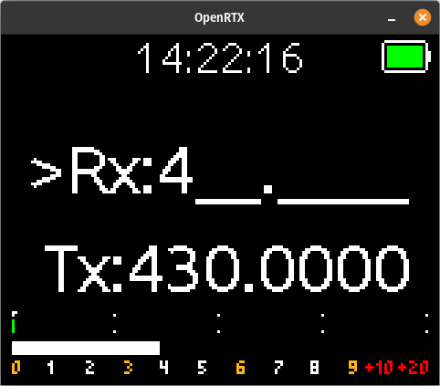
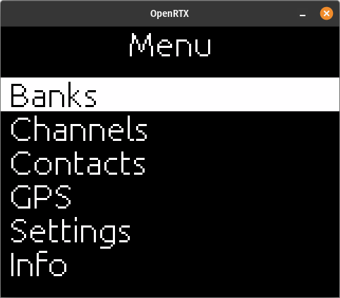
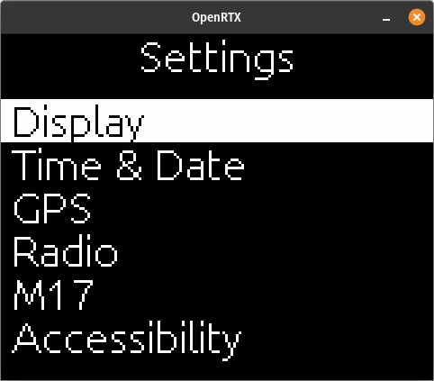
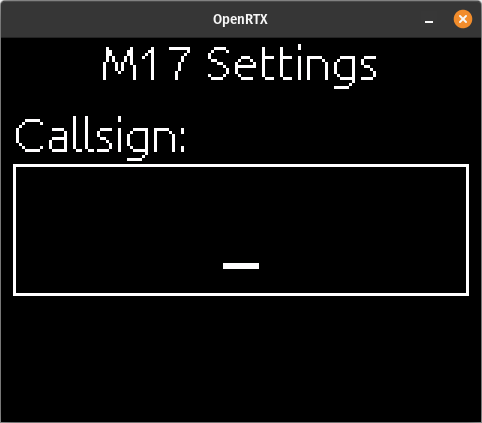

# Operating OpenRTX on the CS7000-M17

Through this guide, references to hardware buttons will be made. For clarity,
the hardware buttons referenced in this document are pictured below.

* SK1 - Side Key 1 - Top button on the left side of the radio. Above the large PTT button.
* SK2 - Side Key 2 - Third button from the top on the left side of the radio. Below the large PTT button.
* SK3 - Side Key 3 - Fourth button from the top on the left side of the radio. Below SK3, second below the large PTT button.
* TK - Top Key - Orange button on the top of the radio. Between the channel select knob and antenna port.
* F1 - Front 1 - Labeled F1 on the front of the radio. Top left hand button.
* F2 - Front 2 - Labeled F2 on the front of the radio. Top right hand button.

Other hardware buttons are labeled on the radio.

## General

### OpenRTX idle screen - FM Mode

From top to bottom, moving left to right:

* Time display :exclamation: `May not be implemented at this time`
* Battery charge indicator
* Mode (FM)
* Frequency in MHz
* VOL/SQL/RSSI Bars
  * Top thin white bar - Volume level
  * Middle orange bar - Squelch level
  * Bottom white bar - RSSI level

### OpenRTX idle screen - M17 Mode

From top to bottom, moving left to right:

* Time display :exclamation: `May not be implemented at this time`
* Battery charge indicator
* Mode and Destination (M17 #ALL)
* Frequency in MHz
* VOL/MIC/RSSI Bars
  * Top thin white bar - Volume level
  * Middle green bar - Mic level (TX)
  * Bottom white bar - RSSI level

## Macro Menu

The Macro Menu in OpenRTX is used for the most commonly used functions on your
radio. 

To access the Macro Menu, press the SK1 button on the left side of the radio.
By default, holding the SK1 button for more than one second will 'latch' the
Macro Menu open, indicated by a small 'M' in a white box in the top left of
the screen, allowing you to make changes without needing to keep SK1
depressed. Pressing SK1 again will 'unlatch' the Macro Menu. The options in the
Macro Menu are selected using the number keys on the front of the radio,
indicated by the numbers in the matrix on the Macro Menu screen.

The options for each mode (FM/M17) are listed below.

### Macro Menu - FM Mode

Options:

1. CTCSS Tone decrease
2. CTCSS Tone increase
3. CTCSS Tone mode
  * E - Encode
  * D - Decode
  * E+D - Encode and Decode
4. Bandwidth selection
  * 12.5 kHz (Narrow)
  * 25 kHz (Wide)
5. Mode select
  * FM
  * M17
6. RF power level
  * 1.0W (Low)
  * 5.0W (High)
7. Screen backlight decrease
8. Screen backlight increase
9. Key lock

### Macro Menu - M17 Mode

1. Not used
2. Not used
3. Not used
4. Not used
5. Mode Select
  * M17
  * FM
6. RF power level
  * 1.0W (Low)
  * 5.0W (High)
7. Screen backlight decrease
8. Screen backlight increase
9. Key lock

## Switching between FM and M17 modes

To switch from FM mode to M17 mode, while at the Idle Screen press the SK1
button to open the Macro Menu, then press the `5` key on the front of the
radio. If the Macro Menu is latched open, press SK1 to unlatch it and return
to the Idle Screen.

## Entering Frequencies

Frequencies are entered while the radio is at the Idle Screen. Frequencies are
entered using up to seven digits, the first three being MHz, the last four are
kHz. When entering frequencies, the first frequency entered will be for receive
(RX) and the second frequency entered will be for transmit (TX).

Example of screen when starting to enter frequencies:

?> :mega: It is not necessary to pad out the frequency entered with zeros. You can use the `OK` button to accept without needing extra button presses.

For example, to enter in 433.475 MHz (IARU Region 1 frequency for M17
mode) you would press:

`4 3 3 4 7 5 ` `OK` `OK`

This will set the RX frequency to 433.475 MHz without needing the padding zero,
and the second `OK` button press will accept the TX frequency to be the same as
the RX frequency, setting the radio to simplex mode.

For a frequency split, such as with repeaters, enter the RX frequency first (TX
frequency of the remote transceiver), followed by the TX frequency (RX frequency
of the remote transceiver).

## Changing your Call Sign

For the M17 digital mode, a valid call sign needs to be entered into the radio
before transmitting. To do this:

1. While at the M17 Idle Screen, press the `OK` button. You will be presented
with the main menu like below:

| :exclamation: This screenshot may show options not currently available |
|------------------------------------------------------------------------|

2. Use the up and down arrow keys to highlight the Settings menu option, and
press the `OK` button.

| :exclamation: This screenshot may show options not currently available |
|------------------------------------------------------------------------|

3. Use the up and down arrow keys to highlight the M17 menu option, and press
the `OK` button.

4. While the Callsign menu option is highlighted, press the `OK` button.

5. Use the number keys `1` through `9` to enter your callsign. The input style
is similar to the old cellphone "T9" input method, multiple presses of a single
key will advance to the next letter for that key. For example, pressing the `2`
key multiple times will advance through `A` `B` `C` and `2`. If you need to
enter multiple letters with the same key (such as needing the letter A and then
B), pause for a few seconds after entering the first letter, then use the same
key again to enter the second letter.

?> :exclamation: If you make a mistake entering a character, press the Down
arrow key to erase/backspace.

| :exclamation: Use your own callsign, this is just an example |
|--------------------------------------------------------------|

6. Once your callsign is entered, press the `OK` button to accept.

7. Press the `BACK` button three times to return to the M17 Idle Screen.

## Changing Destinations

## Additional Settings